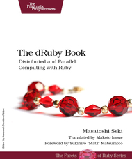
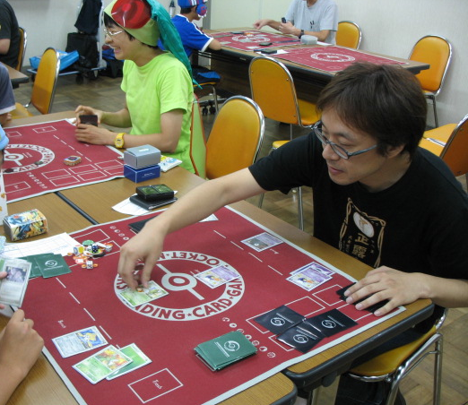
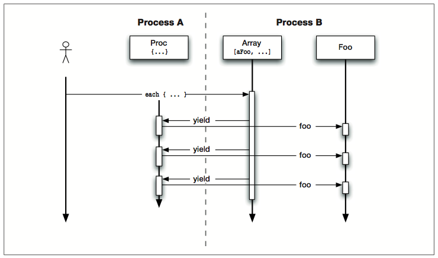

!SLIDE bullets
# Demystifying dRuby #

* [@makoto_inoue](https://twitter.com/makoto_inoue) ([@newbamboo](https://twitter.com/newbamboo)) 
* [LRUG April 2012](http://lrug.org/meetings/2012/03/26/april-2012-meeting/)

!SLIDE bullets incremental
# Who is Masatoshi Seki? #

* Author of dRuby, Rinda, and ERB
* Ruby core committer (Rubyist since 1998)
* C by Day, Ruby by Night
* Never used Rails (Can't install!!)
* Pokemon Master

!SLIDE bullets incremental

# Who is Masatoshi Seki? #
## Pokemon Master

!SLIDE bullets incremental

# Who is Masatoshi Seki? #
## Pokemon Master

!SLIDE bullets incremental

# Who is Masatoshi Seki? #
## Artist

!SLIDE bullets incremental

# Who is Masatoshi Seki? #
## Resembles?

!SLIDE bullets incremental

# What I want to talk about today

* dRuby == Creative & fun
* Mastering dRuby == Mastering Ruby
* Please buy the book(promo code in the last slide)

!SLIDE bullets incremental

# Topics

* Basics of dRuby
* Internals of dRuby
* Pass by value, Pass by reference
* Rinda
* Drip

!SLIDE bullets incremental

# Basics of dRuby

* Distributed Ruby
* 100% written in Ruby
* Part of Ruby Standard libraries
* Proxy to remote object

!SLIDE
# Basics of dRuby
## Server

    @@@ ruby
    require 'drb/drb'                                           
    class Puts                                                  
      def initialize(stream=$stdout)
        @stream = stream
      end

      def puts(str)
        @stream.puts(str)
      end
    end

!SLIDE
# Basics of dRuby
## Server
    
    @@@ ruby
    DRb.start_service(uri, Puts.new)                            
    DRb.thread.join()

!SLIDE
# Basics of dRuby
## Client

    @@@ ruby
    require 'drb'
    there = DRbObject.new_with_uri('druby://:12345')
    there.puts("hello world")

!SLIDE bullets
# Basics of dRuby
## Example

* [http://www.screenr.com/embed/lO18](http://www.screenr.com/embed/lO18)
  <iframe src="http://www.screenr.com/embed/lO18" width="650" height="396" frameborder="0"></iframe>

!SLIDE bullets incremental
# Basics of dRuby
## What you just learnt

- DRb.start_service
- DRbObject.new\_with\_uri
- DRb.thread.join()

!SLIDE
# Internals of dRuby
## Where is the source?

    @@@ sh
    [.rvm]$ find . -name 'drb' -print
    ./src/ruby-1.9.3-p0/lib/drb
    ./src/ruby-1.9.3-p0/sample/drb
    ./src/ruby-1.9.3-p0/test/drb

!SLIDE

# Internals of dRuby
## Let's play with same samples  

    @@@ sh
    ruby  ~/.rvm/src/ruby-1.9.3-p0/sample/drb/drchats.rb
    ruby  ~/.rvm/src/ruby-1.9.3-p0/sample/drb/drchatc.rb

!SLIDE bullets 

# Internals of dRuby
## The first dRuby

* [160 lines of code](http://blade.nagaokaut.ac.jp/cgi-bin/scat.rb/ruby/ruby-list/15406)   

!SLIDE bullets 

# Internals of dRuby
## Code Reading

* [origin/drb\_origin.rb](origin/drb_origin.rb)

!SLIDE

# Internals of dRuby
## method\_missing

    @@@ruby
    class DRbObject
      def method_missing(msg_id, *a)
        succ, result = DRbConn.new(@uri).
          send_message(self, msg_id, *a)
        raise result if ! succ
        result
      end
    

!SLIDE

# Internals of dRuby
## Marshall::Dump

    @@@ruby
    module DRbProtocol
      def dump(obj, soc)
        begin
          str = Marshal::dump(obj)

!SLIDE

# Internals of dRuby
## DRbObject.new(obj)

    @@@ruby
        rescue
          ro = DRbObject.new(obj)
          str = Marshal::dump(ro)
        end
        soc.write(str) if soc
        return str
      end
    end

!SLIDE bullets incremental

# Internals of dRuby
## What you learnt

* method_missing as proxy
* Marshal.dump everything
* If failed, dump DRbObject

!SLIDE bullets incremental
# Pass by Value, Pass by Reference
## Things you can not Marshal.dump

* IO,File, Socket, etc
* Proc

!SLIDE bullets
# Proc Example
## [Server](basic/server/hash_s.rb)

    @@@ruby
    front = {}
    DRb.start_service('druby://:7640', front)
    server_proc = Proc.new{ `pwd`}
    front['server_proc'] = server_proc
    while true
      sleep 1; puts "\n"; pp front;
      front.each { |k,v| p "#{k}:  #{v[]}"}
    end

!SLIDE
# Proc Example
## [Client](basic/client/hash_c.rb)

    @@@ruby
    DRb.start_service
    remote = DRbObject.new_with_uri('druby://:7640')

    client_proc = Proc.new{`pwd`}
    remote['client_proc'] = client_proc

    DRb.thread.join

!SLIDE bullets

# Proc Example

* [http://www.screenr.com/embed/ZO18](http://www.screenr.com/embed/ZO18)

  <iframe src="http://www.screenr.com/embed/ZO18" width="650" height="396" frameborder="0"></iframe>

!SLIDE bullets incremental

# Proc Example
## What you learnt

* Client is also Server
* DRbObject keeps reference

!SLIDE
# Enumerable Example
## [Server](basic/server/array_s.rb)

    @@@ruby
    require 'drb'
    arry = Array.new(10){ Proc.new{ p `pwd`}}
    DRb.start_service('druby://:7640', arry)
    DRb.thread.join

!SLIDE
# Enumerable Example
## [Client](basic/client/array_c.rb)

    require 'drb'
    DRb.start_service
    arry = DRbObject.new_with_uri('druby://:7640')

    arry.each{|a| p `pwd`; a[]}

!SLIDE bullets 
# Enumerable Example

* [http://www.screenr.com/kO18](http://www.screenr.com/kO18)

  <iframe src="http://www.screenr.com/embed/kO18" width="650" height="396" frameborder="0"></iframe>

!SLIDE
# Enumerable Example

!SLIDE bullets incremental

# Enumerable Example
## What you learnt

* "each" happens locally
* "yield" happens remotely
* No "deadlock" thanks to Thread

!SLIDE bullets incremental
# dRuby - use case

* [Battleship](http://lrug.org/meetings/2011/09/)
* Testing, Debugging, Monitoring utilities
* Network server for embedded tool(eg: Sqlite)

!SLIDE bullets incremental
# Rinda

* Part of Ruby standard libraries
* Port of Linda
* Process Coordination Mechanism
* Distributed TupleSpace
* Share via dRuby

!SLIDE 
# Rinda
## TupleSpace

    @@@ ruby
    ['abc', 2, 5]
    [:matrix, 1,6, 3.14]
    ['family', 'is-sister', 'Carolyn']

!SLIDE bullets incremental
# Rinda
## Operations

* write
* read, read\_all
* take = read+delete

!SLIDE
# Rinda
## [Example](basic/server/rinda_ts.rb) (TupleSpace)

    @@@ruby
    require 'drb/drb'
    require 'rinda/tuplespace'
    ts = Rinda::TupleSpace.new
    DRb.start_service('druby://:7641', ts)
    DRb.thread.join

!SLIDE bullets
# Rinda
## Example

* [http://www.screenr.com/Bp18](http://www.screenr.com/Bp18)

  <iframe src="http://www.screenr.com/embed/Bp18" width="650" height="396" frameborder="0"></iframe>

!SLIDE 
# Rinda
## Pattern Matching

    @@@ ruby
    ts.take([/add|sub/, Integer])
    ts.take([nil, (10..Float::INFINITY)])

!SLIDE 
# Rinda
## ===

    @@@ ruby
    class Njet
      def initialize(value)
        @value = value
      end

      def ===(other)
        ! (@value === other)
      end
    end
    ts.take['age', Njet.new(23)]

!SLIDE bullets incremental
# Rinda
## Other features

* notify (trigger)
* Hash API
* Ring (Name Server)

!SLIDE bullets incremental

# Rinda - use case

* Simple task management tools
* Use it with "fork"(gem install rinda_eval)

!SLIDE bullets incremental
# Seki san's current experiment

* PTupleSpace (2007) = Persisted tuplespace
* MapReduce, OODB (2009)
* Drip (2011) = Immutable datastore

!SLIDE bullets
# Drip

* gem install drip

!SLIDE bullets incremental

# Drip
## Immutable datastore

* Append Only
* Each data has key as time stamp
* Can traverse older/newer
* Can add "Tag"

!SLIDE bullet
# Drip
## write(value, *tags)

    @@@ruby
    MyDrip.write(20, 'seki.age', 'male')
    MyDrip.write(14, 'sora_h', 'male')
    MyDrip.write(29, 'kate', 'female')

!SLIDE bullets
# Drip
## read(key, n=1, at\_least=1, timeout=nil)

    @@@ruby
    k = 0
    while k 
      sleep 2
      r = MyDrip.read(k, 4, 1, 2)
      pp r; puts "\n"
      k = r[-1][0]
    end

!SLIDE
# Drip
## head(n=1, tag=nil)
  
    @@@ruby
    k,v, *tags = MyDrip.head(1, 'male')[0]
    # => [1333437978553705, 30, "will", "male"]

!SLIDE
# Drip
## older(key, tag=nil)

    @@@ruby
    k,v, *tags = MyDrip.older(k, 'male')

!SLIDE bullets
# Drip(Example)

* [http://www.screenr.com/9X18](http://www.screenr.com/9X18)

  <iframe src="http://www.screenr.com/embed/9X18" width="650" height="396" frameborder="0"></iframe>

!SLIDE bullets incremental
# Drip
## other operations

* newer
* read_tag
* []

!SLIDE bullets incremental
# Drip - use case

* Hash with History
* Recoverable Queue
* Multicast Messaging
* Tweets archive
* Desktop search engine

!SLIDE bullets incremental
# Summary

* dRuby = Feels like Ruby
* Rinda = Cool pattern matching
* Drip = Immutable datastore
* [name of your cool new distributed tools]

!SLIDE bullets
# Thank you

* [@makoto_inoue](https://twitter.com/makoto_inoue) 
* [https://github.com/makoto](https://github.com/makoto/demystifying_druby_lrug_april_2012)
