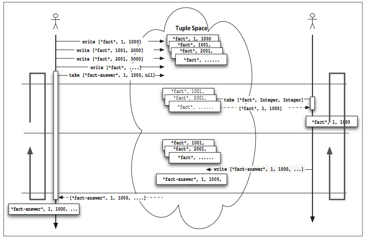
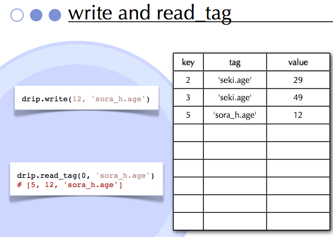

!SLIDE bullets
# Demystifying dRuby #

* @makoto_inoue (@newbamboo)

!SLIDE bullets incremental
# Who is Masatoshi Seki? #

* Author of dRuby, Rinda, and ERB
* Ruby core committer (Rubyist since 1998)
* C by Day, Ruby by Night
* Never used Rails (Can't install!!)
* PokeMon Master

!SLIDE bullets incremental

# Who is Masatoshi Seki? #
## PokeMon Master

!SLIDE bullets incremental

# Who is Masatoshi Seki? #
## PokeMon Master

!SLIDE bullets incremental

# Who is Masatoshi Seki? #
## Artist

!SLIDE bullets incremental

# Who is Masatoshi Seki? #
## Resembles?

!SLIDE bullets incremental

# What I want to talk about today

* dRuby == Creative & fun
* Mastering dRuby == Mastering Ruby
* (buy the book)

!SLIDE bullets incremental

# Topics

* Basic of dRuby
* Internal of dRuby
* Pass by value, Pass by reference
* Rinda
* Drip (if I have enough time)

!SLIDE bullets incremental

# Basic of dRuby

* Distributed Ruby
* 100% written in Ruby
* Part of Ruby Standard libraries
* Proxy to remote object

!SLIDE
# Basic of dRuby
## Server

    @@@ ruby
    require 'drb/drb'                                           
    class Puts                                                  
      def initialize(stream=$stdout)
        @stream = stream
      end

      def puts(str)
        @stream.puts(str)
      end
    end

!SLIDE
# Basic of dRuby
## Server
    
    @@@ ruby
    uri = ARGV.shift
    DRb.start_service(uri, Puts.new)                            
    DRb.thread.join()

!SLIDE
# Basic of dRuby
## Client

    @@@ ruby
    require 'drb'
    there = DRbObject.new_with_uri('druby://:12345')
    there.puts("hello world")

!SLIDE bullets incremental
# Basic of dRuby
## What you just learnt

- DRb.start_service
- DRbObject.new\_with\_uri
- DRb.thread.join()

!SLIDE
# Internal of dRuby
## Where is the source?

    @@@ sh
    [.rvm]$ find . -name 'drb' -print
    ./src/ruby-1.9.3-p0/lib/drb
    ./src/ruby-1.9.3-p0/sample/drb
    ./src/ruby-1.9.3-p0/test/drb

!SLIDE

# Internal of dRuby
## Let's play with same samples  

    @@@ sh
    ruby  ~/.rvm/src/ruby-1.9.3-p0/sample/drb/drchats.rb
    ruby  ~/.rvm/src/ruby-1.9.3-p0/sample/drb/drchatc.rb

!SLIDE bullets 

# Internal of dRuby
## The first dRuby

* [160 lines of code](http://blade.nagaokaut.ac.jp/cgi-bin/scat.rb/ruby/ruby-list/15406)   

!SLIDE bullets 

# Internal of dRuby
## Code Reading

* origin/drb\_origin.rb

!SLIDE bullets incremental

# Internal of dRuby
## What you learnt

* method_missing as proxy
* Marshal.dump everything
* If failed to dump, pass reference
* soc.write(str) to send 

!SLIDE bullets incremental
# Pass by Value, Pass by Reference
## Thing you can not Marshial.dump

* IO,File, Socket, etc
* Proc

!SLIDE bullets
# Pass by Value, Pass by Reference
## Example(Proc)

* Run proc\_s.rb and proc\_c.rb from irb

!SLIDE bullets
# Pass by Value, Pass by Reference
## Example(each)

* Run array\_s.rb and array\_c.rb

!SLIDE
# Example(each)

!SLIDE bullets incremental
# Rinda

* Process Coordination Mechanism
* Port of Linda
* Distributed TupleSpace
* Share via dRuby

!SLIDE 
# Rinda
## TupleSpace

    @@@ ruby
    ['abc', 2, 5]
    [:matrix, 1,6, 3.14]
    ['family', 'is-sister', 'Carolyn']

!SLIDE bullets incremental
# Rinda
## Operations

* write
* read
* take = read+delete

!SLIDE bullets incremental
# Rinda
## Example

    @@@ ruby
    require "rinda/tuplespace"
    ts = Rinda::TupleSpace.new 
    ts.take(["take-test", nil])
    ts.write(["take-test", 1])

!SLIDE bullets incremental
# Rinda
## Example

!SLIDE 
# Rinda
## Pattern Matching

    @@@ ruby
    ts.take([/add|sub/, Integer])
    ts.take([nil, (10..Float::INFINITY)])

!SLIDE 
# Rinda
## Example

!SLIDE 
# Rinda
## ===

    @@@ ruby
    class Njet
      def initialize(value)
        @value = value
      end

      def ===(other)
        ! (@value === other)
      end
    end
    ts.take['age', Njet.new(23)]

!SLIDE bullets incremental
# Rinda
## Other features

* notify (trigger)
* Hash API
* Ring (Name Server)

!SLIDE bullets incremental
# Seki san's current expriment

* PTupleSpace (2007) = Persisted tuplespace
* MapReduce, OODB (2009)
* Drip (2011) = Streaming based storage

!SLIDE bullets incremental
# Drip

* Append Only
* Hash with History
* Recoverable Queue
* Multicast

!SLIDE
# Drip
## Write bullet

* write(obj, *tags)

!SLIDE bullets
# Drip
## Read

* read(key, n=1, at\_least=1, timeout=nil)
* head, older, newer, read\_tag

!SLIDE
# Drip
## Example

!SLIDE
# Summary

* dRuby = Feels like Ruby
* Rinda = Cool pattern matching
* Drip = Immutable datastore

!SLIDE
# Thank you

